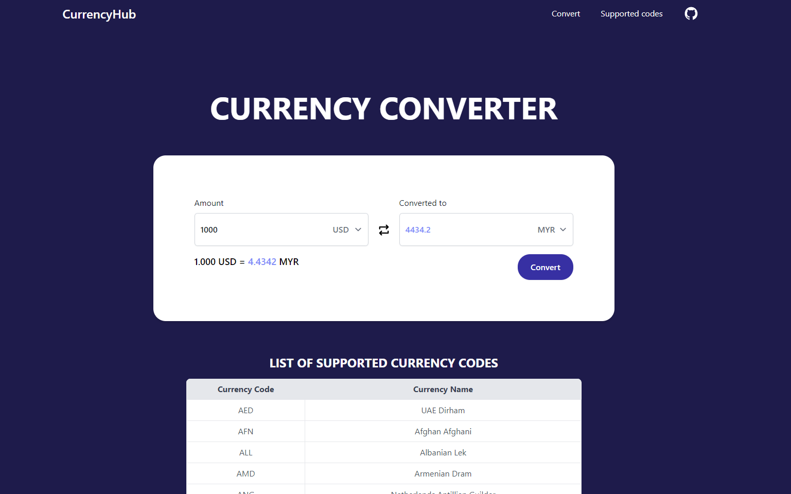

# CurrencyHub | Currency Converter | Foreign Exchange Rates

# Setup
Before cloning this project, please make sure to have an account with [exchangerate-api](https://www.exchangerate-api.com/)

Sign in and head to the [dashboard](https://app.exchangerate-api.com/dashboard) to get your API KEY.

> Clone this repo
```
git clone https://github.com/1HoWK/CurrencyHub.git
```

> Navigate to the backend directory and create .env file
```
touch .env
```

> Paste this lines of code and change accordingly
```
EXCHANGE_RATE_API_KEY="Paste your API KEY here"
PORT = 8000
```

> Navigate to the project directory
```
cd CurrencyHub/
```

